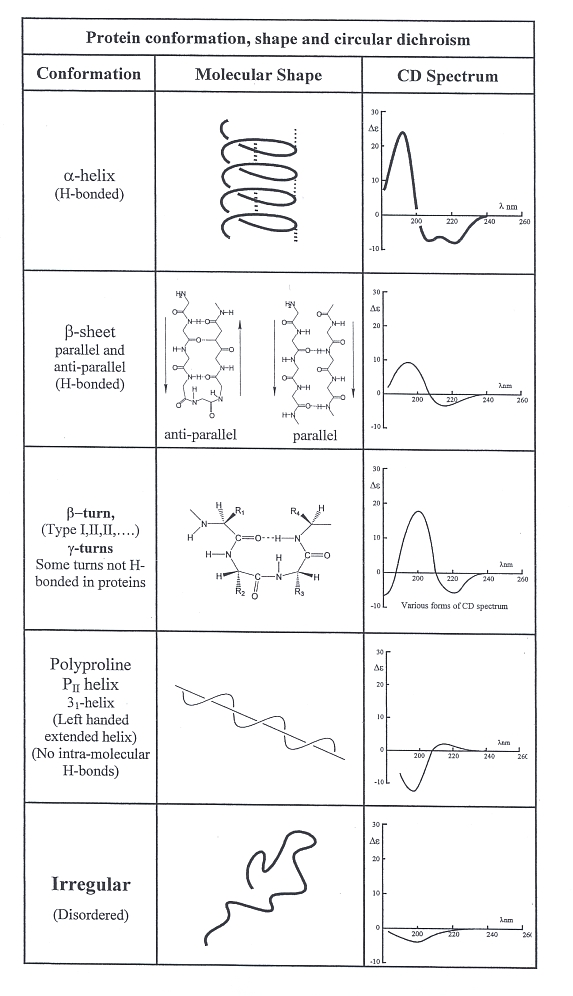

In experiment 6 we have seen CD spectrum of pure secondary structures of a protein eg alpha helix,beta sheet, coil etc. We have seen how these spectra have different characteristics. Following diagram shows the nature of such spectra. 

 

But in practice, proteins are a combination of different types of secondary structures. So CD spectrum of a protein sample will show a combined effect of different types of secondary structures present in it. Now it is important to extract information about presence of different secondary structures in the sample. For that we follow a method called deconvolution. By deconvoluting CD spectra of a protein we can come to know which kind of secondary structure is present in what amount in the protein.

Now in the case of protein structure is conserved more than sequence. Moreover structure is the basis of functions of a protein. So there is a need to order the vast amounts of structural data of protein available. And our common philosophy leads us to study groups rather than individuals. Hence, on the basis of the amount and the type of secondary structures present in a protein, it is classified into different classes.

In this experiment we will see the method of deconvolution and learn the classification rule of protein on the basis of secondary structure.

