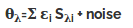
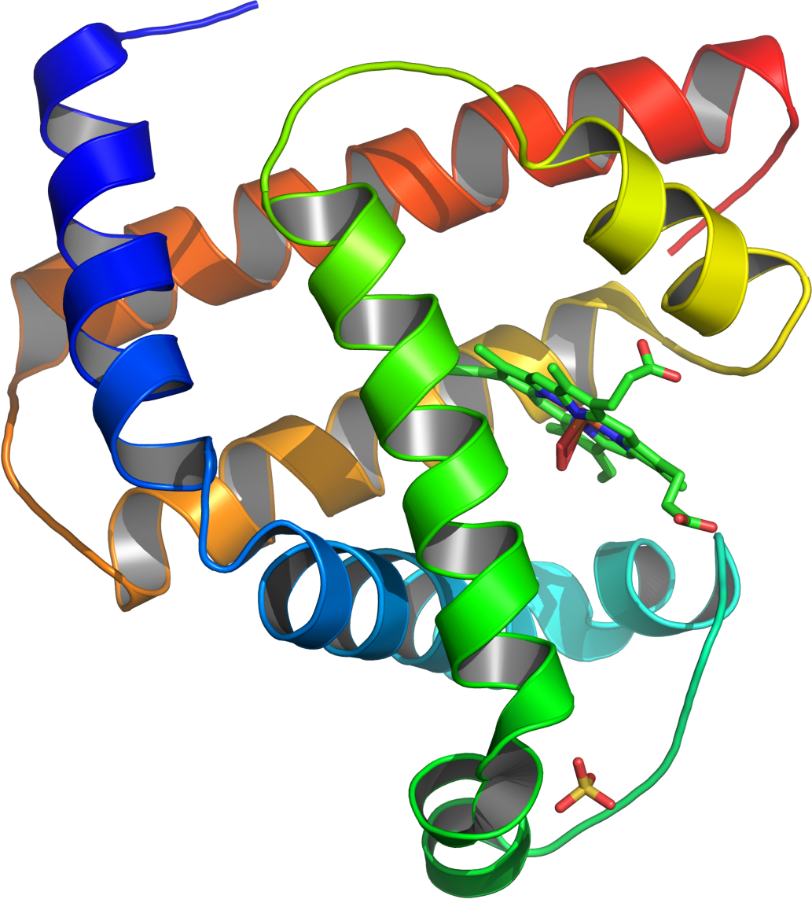
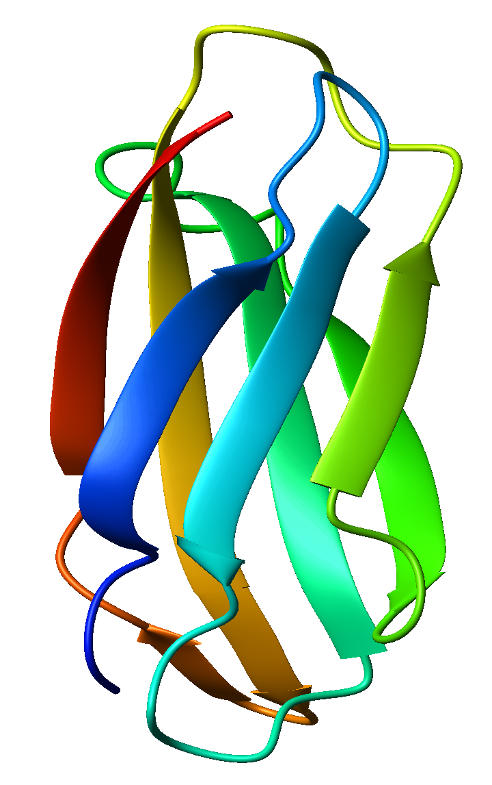
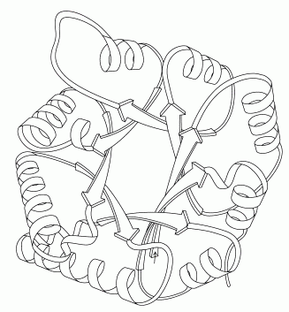

**Deconvolution**

Let us now consider the CD spectrum as a mathematical functional or signal. We will first see what is called convolution of such signals.

Convolution is a mathematical operation on two functions, producing a third function that is typically viewed as a modified version of one of the original functions. In this context these initial functions are CD spectra of known pure secondary structures which convolute to give rise to a complex spectrum of a real protein.

Deconvolution is an algorithm-based process used to reverse the effects of convolution on recorded data. Now to deconvolute a CD spectrum of a protein sample we have to:

  1. Obtain a proper set of basis.
  2. Perform the data fitting procedure.

A basis set is a set of components chosen in such a way that your experimental CD spectrum can be view as a linear combination of them. If these basis were obtained from a set of reference protein whose structure and CD is known, we can obtain structural information on our protein as well.

**Different Processes of Deconvolution of CD spectrum**

All methods of analyzing CD spectra assume that the spectrum of a protein can be represented by a linear combination of the spectra of its secondary structural elements, plus a noise term, which includes the contribution of aromatic chromophores and prosthetic groups. 

where θλ is the CD of the protein as a function of wavelength, εi is the fraction of each secondary structure, i, and Sλi is the ellipticity at each wavelength of each ith secondary structural element. In constrained fits, the sum of all the fractional weights, εi, must equal one and all of the fractional contributions must be greater than or equal to zero. 

There are two general classes of methods to evaluate protein conformation.

 1. The first uses standards of polypeptides, with defined compositions in known conformations, which have been determined by X-ray scattering of films or by IR in solution.
 2. The second uses the spectra of proteins which have been characterized by X-ray crystallography as standards. These are then compared to the spectra of unknown proteins using least squares analysis, ridge regression, singular value decomposition, single value decomposition with variable selection; the self consistent method; or neural network analysis.
    
The protein-based analyses are superior when analyzing the conformation of globular, well-folded proteins. So we will discuss three different methods of second type. 

**1. Ridge Regression based method CONTIN:**

*Principle:*CONTIN fits the CD of unknown proteins by comparison to a linear combination of the spectra of a large database of proteins with known conformations. In this method the contribution of each reference spectrum is kept small unless it contributes to a good agreement between the theoretical best fit curve and the raw data.

*Advantage:* This method results in relatively good estimates of α-helices and β-sheets. Different references are used for every fit, which is an advantage for obtaining the best fits of the data. 

Disadvantage: Complicates the quantitative analysis of the effect of a mutations or denaturant, since a different set of standards is used for each analysis.

**(2) & (3) Neural Network based approach CDNN & K2D:**

**Process:** A neural network is an artificial intelligence program used to find correlations in data. A neural network is first trained using a set of known proteins so that the input of the CD at each wavelength results in the output of the correct secondary structure. The trained network is then used to analyze unknown proteins. Two widely used programs are CDNN and K2D.

*Advantage:* CDNN analyzes data to determine helix, anti and parallel β- structure, turns and remainder and K2D determines helix, total β-structure and remainder. K2D gives a good estimate of the helical and sheet contents of both proteins and polypeptides. 

Disadvantage: However, the K2D program does not estimate turns. CDNN is not suitable for the analysis of polypeptides and it currently is not being distributed. 

**Classification of Globular Proteins According to Secondary Structure:**  

As we have discussed in the introduction section, structure is more conservative than sequence and structure of a protein directly controls its functions. So it is important to classify proteins depending on its secondary structure and study proteins as a group having common structural properties.   

Here are four types of classes of proteins classified on the basis of their secondary structure. 

*All alpha:* Proteins that contain only (in some exceptional instances there may be isolated beta-sheets) alpha helical secondary structure. [Myoglobin](http://en.wikipedia.org/wiki/Myoglobin) is an example of an all alpha protein. 

 

Source:[http://en.wikipedia.org/wiki/File:Myoglobin.png](http://en.wikipedia.org/wiki/File:Myoglobin.png)  

*All beta:* Protein that contain only (in some exceptional instances there may be isolated alpha helices) beta-sheet secondary structure. [Tenascin](http://en.wikipedia.org/wiki/Tenascin) is an example of an all beta protein.   

Source:[http://en.wikipedia.org/wiki/File:1ten_fibronectin_type_III.png](http://en.wikipedia.org/wiki/File:1ten_fibronectin_type_III.png)

*Alpha / beta:* Proteins that contain alternating alpha-helical and beta-sheet secondary structure elements. [Triose Phosphate Isomerase](http://en.wikipedia.org/wiki/Triosephosphate_isomerase) is an example of an alpha/beta protein. This structure is known as a [TIM barrel](http://en.wikipedia.org/wiki/TIM_barrel). The alternating helical and sheet segments form a closed barrel like structure.

 

Source:[http://en.wikipedia.org/wiki/File:RNase_A.png](http://en.wikipedia.org/wiki/File:RNase_A.png)

**Goal of The Experiment:**
In this experiment we will observe results of different deconvolution methods. Compare them and will try to classify proteins from those result
